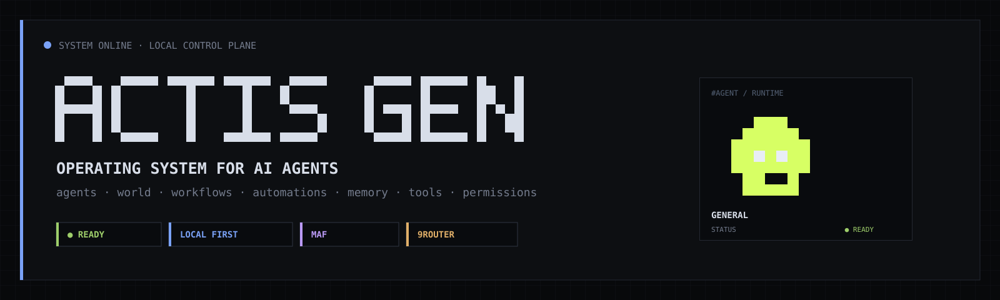

<p align="center">
  
</p>

<p align="center">
  <strong>Local-first control plane for persistent AI agents that operate real software.</strong><br>
  Agents, skills, organizational context, memory, permissions, Work/Tasks, World, automations, workflows and harnesses in one runtime.
</p>

<p align="center">
  <code>LOCAL FIRST</code> · <code>AGENT CONTROL PLANE</code> · <code>MAF</code> · <code>9ROUTER</code> · <code>MCP</code> · <code>SQLITE</code>
</p>

---

## `[ SYSTEM / OVERVIEW ]`

**ACTIS GEN** is a local-first operating system/control plane for AI agents.

The project does not create a new runtime for every app or domain. It keeps a common execution kernel and specializes each agent through identity, model, instructions, skills, context, memory, permissions, organization and state.

> **Core principle:** `generalize infrastructure; specialize agent + knowledge + state + context + permissions + skills`

ACTIS coordinates. **Microsoft Agent Framework** executes. **9Router** resolves model/provider. **Harnesses/MCPs** operate browsers, files, terminal, desktop and domain-specific transports.

**Current-state rule:** active local runtime/code is the source of truth. `BETA` and `EXPERIMENTAL` entries below describe the active working tree and are not a hardened release contract.
## `[ WHAT EXISTS TODAY ]`

| module | state | current role |
|---|:---:|---|
| **Agents** | `READY` | persistent identity, model, instructions, skills, tools, scopes, memory and organization |
| **Conversations** | `READY` | persistent chat history separated from execution Runs |
| **Runs** | `READY` | lifecycle, cancellation, heartbeat, activity and result history |
| **Work / Tasks** | `READY` | visible objective, steps, progress, next action, evidence and completion gate |
| **World** | `READY` | live operational space organized by company/sector with global chat and delegations |
| **Skills** | `READY` | inheritable declarative capabilities with progressive disclosure |
| **Context** | `READY` | company → sector → project → agent hierarchy |
| **Memory** | `READY` | cross-conversation SQLite + FTS5 retrieval |
| **Approvals** | `READY` | persistent scope requests, approval, denial and revocation |
| **Automations** | `READY` | `once`, `interval`, `daily` and `condition` triggers |
| **Workflows** | `READY` | executable Start / Agent / Condition / End graphs with persisted traces |
| **Event Bus** | `READY` | persistent operational events |
| **Browser / Files / Terminal / Computer** | `READY` | harness/MCP capabilities filtered by real scopes |
| **Statistics** | `READY` | Run usage, model/agent ranking, success and latency views |
| **Channels / Agent Bus** | `BETA` | persistent Slack-like coordination and long-term directives |
| **ACTIS Config / Connectors** | `BETA` | connector registry, health checks and per-agent visibility |
| **WhatsApp local-first runtime** | `BETA` | local shadow, sync continuity, outbox, verified send, handoff and inbox state |
| **Desktop Assistant** | `EXPERIMENTAL` | always-on-top Linux assistant backed by a normal ACTIS agent |
| **Mobile employee client** | `ROADMAP` | restricted operational client controlled by desktop/admin permissions |
| **Public multi-tenant deployment** | `LOCKED` | not safe/supported in the current local single-user phase |
## `[ RUNTIME MAP ]`

```text
Conversation / World / Direct Chat / Automation / Workflow / Delegation
                               ↓
                  ExecutionService.execute_agent()
                               ↓
        agent + model + skills + context + memory
        tools + scopes + approvals + timeout + task
                               ↓
                         Harness Core
                               ↓
                 Microsoft Agent Framework
                               ↓
                           9Router
                               ↓
                      provider / model
                               ↘
 Browser Harness / Files / Terminal / Computer / Domain Tools
                               ↘
                WhatsApp local runtime / Connectors
```

There are no separate execution engines for chat, World, delegation or automation. They converge on the same kernel, so the target agent keeps the same skills, permissions, context and memory regardless of entry point.

**Conversation ≠ Run ≠ Task ≠ Agent.** Conversation stores dialogue; Run is one execution; Task projects operational progress; Agent is the persistent worker.
## `[ AGENT MODEL ]`

Each agent can combine:

```text
identity       → name, appearance, GEN-01 presence
model          → provider/model through 9Router
instructions   → agent-specific behavior
skills         → reusable/inheritable capability bundles
context        → company / sector / project / agent
memory         → cross-conversation retrieval
channels       → long-term shared directives and decisions
tools          → runtime capabilities
permissions    → permanent scopes + approved scopes
state          → ready / running / planned / blocked / failed / etc.
organization   → company + sector placement
```

The `general` agent can receive `actis.control-plane` and operate ACTIS itself through `actis_*` tools instead of merely describing administrative actions.

## `[ SKILLS / PROGRESSIVE DISCLOSURE ]`

Skills are declarative and inheritable. A skill can contribute tools, scopes, runtime features and instructions. Only relevant skill instructions are expanded for a Run, reducing prompt noise while preserving a complete capability manifest.

Current catalog includes operator skills for Browser, Computer, Files, Terminal and Desktop; ACTIS control-plane/workflow skills; Instagram browser operation; and layered WhatsApp skills for transport, messaging, inbox, labels, routing, AI handoff and customer service.
## `[ WORK / TASK EXECUTION ]`

Every Run can be projected as an operational Task visible in chat and World.

```text
objective
├─ understand
├─ act
├─ verify
└─ report

+ progress
+ next action
+ evidence
+ completion gate
```

The execution kernel detects responses that only announce future intent (for example, “I will check that now”) and can continue the agent automatically instead of immediately accepting the Run as completed. If the agent still does not produce a real result, the Run can remain `planned` rather than falsely reporting completion.

Browser work also has a verification gate: after relevant interactions, ACTIS can refuse a success claim when deterministic post-action verification is missing.

This is still not durable checkpoint/resume execution: Tasks describe and constrain live work, but a process restart does not yet resume an arbitrary Run from the exact last completed step.
## `[ TOOLS / PERMISSIONS / APPROVALS ]`

| tool | primary scopes |
|---|---|
| Harness Browser | `browser.read`, `browser.interact` |
| Harness Files | `files.read`, `files.write` |
| Harness Terminal | `terminal.exec` |
| Harness Computer | `computer.view`, `computer.control` |
| ACTIS Admin | `actis.admin` |

A tool being present does **not** imply unrestricted access. ACTIS resolves effective tools and scopes before execution, and Browser/Files/Computer MCP operations are filtered by those effective scopes.

An agent can request a missing valid scope with:

```text
ACTIS_APPROVAL_REQUEST: files.write
```

The request becomes a persistent Approval. The operator can approve, deny or later revoke it; approved scopes become effective on following Runs.

## `[ ORGANIZATION / CONTEXT / WORLD ]`

ACTIS treats organization as first-class state, not as prompt decoration: `company → sector → project → agent`. Context items can be instructions, knowledge, documents, facts, notes, procedures, state or references; pinned items always win and other items are selected by lexical relevance + priority.
World is the live operational surface: agents are grouped by company/sector, active Tasks and delegations are visible, global chat can invoke agents, and different agents may execute concurrently while the same direct/global agent is protected from duplicate simultaneous requests.

## `[ CHANNELS / AGENT BUS ]`

ACTIS now has persistent Slack-like coordination channels with scopes `global`, `company`, `sector`, `agent` and `members`.

Messages can be ordinary notes or long-term operational items:

```text
message · decision · goal · rule · note
```

Pinned/long-term active items can be injected into applicable agents as persistent coordination context. This makes channels useful for decisions, rules and objectives that should survive individual conversations.

The built-in **ACTIS Agent Bus** reuses this channel layer for persistent agent-to-agent coordination instead of introducing a second messaging system.

## `[ MEMORY ]`

When memory is enabled, successful executions can store compact cross-conversation memories in SQLite. Retrieval uses FTS5 with recency fallback and injects a bounded set of relevant memories into later Runs.

Current limitation: memory is textual/lexical; there is no embedding/vector store or entity graph in this version.
## `[ WHATSAPP LOCAL-FIRST RUNTIME ]`

The WhatsApp domain is no longer just “an agent opening WhatsApp Web”. The current working tree includes a local operational shadow around the browser transport:

```text
WhatsApp Web
    ↓ incremental sync
local SQLite shadow
    ├─ contacts / conversations
    ├─ messages + FTS search
    ├─ sync continuity / anchor state
    ├─ inbox status / priority / owner
    ├─ labels + persisted intent
    └─ outbox
            ↓
      deterministic dispatcher
            ↓
      DOM send + ACK verification
```

The outbox supports idempotency keys, retries, `failed`/`dead` states and an `uncertain` state that is not blindly retried when delivery acknowledgement is ambiguous. Automatic messaging respects conversation automation modes and a global kill switch.

Human handoff is runtime state, not just prompt text: a conversation can move to `human_only`, later resume as `supervised`/other allowed mode, and preserve inbox/label state.

Incremental sync records continuity anchors and can mark `gap_suspected` when ACTIS cannot prove that local history overlaps correctly with the WhatsApp history it reached.
## `[ ACTIS CONFIG / CONNECTORS ]`

ACTIS Config is the central connector registry. It separates software connection state from individual agent definitions.

Built-ins currently include:

- **9Router** — model/provider gateway health and visibility;
- **ACTIS Agent Bus** — persistent internal channels and agent discovery.

Generic HTTP connectors can store a base URL, auth strategy, environment credential reference, declared capabilities and authorized agents. Secrets are referenced by environment variable name instead of being persisted in the connector record.

The current layer is a **registry + authorization/health foundation**. It does not yet turn arbitrary connector capabilities into a complete executable tool schema/runtime. That adapter/runtime layer is a next architectural step.

## `[ AUTOMATIONS / WORKFLOWS ]`

Automations support `interval`, `daily`, `once` and `condition` triggers. The scheduler is independent from the web UI and executes the same canonical agent kernel.

Workflows are executable, not merely visual. Current nodes are Start, Agent, Condition and End; Agent nodes execute normal ACTIS agents and workflow runs persist per-node traces. Current conditions are intentionally simple (`contains`, `not contains`, `equals` and substring checks), and execution is sequential rather than native fan-out/fan-in.
## `[ INTERFACE ]`

The local web control plane currently includes operational surfaces for:

```text
Agents        World          Automations
Workflows     Approvals      Events
Runs          Statistics     Models
Tools/Skills  Companies      Config/Connectors
Channels      About/Docs
```

The visual identity is intentionally **pixelated + gamified + technical + dark/austere**. ACTIS should look like living infrastructure, not a generic SaaS dashboard.

Agents share the **GEN-01** visual species. Individual identity comes from expression, accessory and accent/company treatment while retaining a common anatomy. Animation is used to communicate state/activity rather than as permanent decoration.

The canonical design specification is [`docs/VISUAL-SYSTEM.md`](docs/VISUAL-SYSTEM.md).

## `[ DESKTOP ASSISTANT ]`

The working tree contains an experimental GTK/Linux always-on-top assistant. It resolves an agent with the `desktop.operator` skill, keeps a normal ACTIS conversation and sends requests through the same HTTP/runtime path as the web control plane.

It is an interface to an ACTIS agent — not a second agent runtime.
## `[ STORAGE ]`

Canonical local storage:

```text
~/.local/share/actis-gen/actis.db
```

SQLite runs in WAL mode with foreign keys. Structured tables cover Events, Memories/FTS, Approvals, Workflows, Workflow Runs, Channels and the WhatsApp domain. Flexible ACTIS entities such as agents, Runs, Tasks, companies, sectors, conversations, automations and connector records are persisted through the common storage layer/collections where applicable.

Legacy JSON/JSONL files are migration sources, not the canonical runtime database.

## `[ MODEL GATEWAY ]`

9Router remains a separate OpenAI-compatible gateway. It owns provider authentication, provider/model routing and upstream fallback. ACTIS owns agent identity, requested model, execution state, tools, context and permissions.

ACTIS exposes model/provider diagnostics and a direct model probe. Model health shown in the UI is observed operational state, not an intelligence benchmark.

## `[ QUICK START ]`

```bash
python3 -m venv .venv
source .venv/bin/activate
python -m pip install -e '.[dev]'
cp .env.example .env
```
Configure at least the 9Router connection/model settings expected by your environment, then run the relevant processes:

```bash
actis-gen chat
actis-gen-web
actis-gen-scheduler
```

Optional/working-tree entry points:

```bash
actis-gen-desktop
actis-gen-whatsapp-sync
actis-gen-smoke
```

Default local web UI:

```text
http://127.0.0.1:8765
```

Observed local architecture uses ACTIS web on `127.0.0.1:8765`, 9Router on `127.0.0.1:20128`, per-agent local Browser CDP ports and an independent user-level scheduler service.

> The current repository is an active development working tree. Do not treat the current branch as a hardened public release, and do not expose the unauthenticated local HTTP API directly to the public internet.

## `[ PRODUCT DIRECTION ]`

The intended product split is becoming explicit: **Desktop = admin/control plane**; future **Mobile = restricted operational client**. An administrator creates agents, companies, sectors, skills, workflows and permissions on desktop, while employees should only see the agents, tasks and business actions explicitly released to their role.
Near-term architectural priorities:

1. **Durable execution** — persistent checkpoints/resume instead of only live Run/Task state.
2. **Connector runtime** — convert connector capabilities into standardized executable tools/skills.
3. **User/RBAC layer** — admin vs employee identity, released agents and business-level scopes.
4. **Mobile operational client** — task/pedido/agent UX without exposing the full control plane.
5. **Distributed workers** — allow browser/desktop/mobile capabilities to execute on authorized remote workers while sharing ACTIS state.

## `[ CURRENT LIMITS ]`

- local single-user operation; no complete authentication/RBAC/tenancy yet;
- local HTTP API is not hardened for direct public exposure;
- memory uses FTS5/recency, without embeddings/vector retrieval;
- Run/Task progress is not yet durable step-level checkpoint/resume;
- workflow conditions are intentionally simple and execution is sequential;
- connector registry does not yet provide a universal adapter/runtime for arbitrary APIs;
- Browser/Computer execution still depends on local/session-specific runtime constraints;
- Desktop Assistant and WhatsApp domain are active working-tree features, not hardened releases;
- deployment/install is currently machine-oriented rather than a reproducible multi-node production distribution;
- the repository currently contains substantial uncommitted working-tree development that still needs release consolidation.

## `[ DOCUMENTATION ]`

| document | purpose |
|---|---|
| [`ACTIS-GEN-ESTADO-ATUAL.md`](docs/ACTIS-GEN-ESTADO-ATUAL.md) | detailed audited product snapshot |
| [`ARCHITECTURE.md`](docs/ARCHITECTURE.md) | architecture and boundaries |
| [`EXECUTION.md`](docs/EXECUTION.md) | Run lifecycle and execution semantics |
| [`API.md`](docs/API.md) | local HTTP API |
| [`OPERATIONS.md`](docs/OPERATIONS.md) | processes, storage and local operation |
| [`MAF-INTEGRATION.md`](docs/MAF-INTEGRATION.md) | Microsoft Agent Framework + MCP integration |
| [`MODEL-GATEWAY.md`](docs/MODEL-GATEWAY.md) | 9Router/model gateway |
| [`VISUAL-SYSTEM.md`](docs/VISUAL-SYSTEM.md) | canonical product visual language |
| [`BLOCKS.md`](docs/BLOCKS.md) | roadmap blocks |

---

<p align="center">
  <strong>ACTIS GEN</strong><br>
  <code>CONTROL · CONTEXT · CAPABILITIES · EXECUTION</code>
</p>
