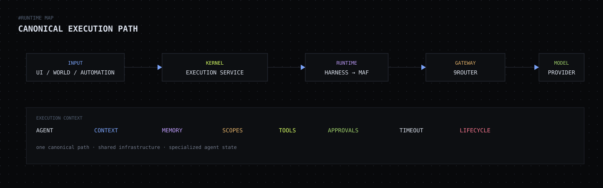

<p align="center">
  
</p>

<p align="center">
  <strong>Control plane local para agentes de IA.</strong><br>
  Agentes persistentes, contexto, memória, tools, permissões, World, Runs, automações e workflows em uma infraestrutura comum.
</p>

<p align="center">
  <code>LOCAL FIRST</code> · <code>MAF</code> · <code>9ROUTER</code> · <code>MCP</code> · <code>SQLITE</code>
</p>

---

## `[ SYSTEM / OVERVIEW ]`

ACTIS GEN é um **sistema operacional/control plane para agentes de IA**. A proposta é reutilizar uma infraestrutura de execução estável e especializar cada agente por identidade, modelo, instruções, contexto, memória, ferramentas, permissões e posição organizacional.

> **Princípio central:** `generalizar infraestrutura; especializar agente + conhecimento + estado + contexto + permissões + tools`

O ACTIS coordena. **MAF** executa. **9Router** resolve provider/modelo. **MCPs** operam software e sistema real.

## `[ MODULE STATUS ]`

| módulo | estado | função |
|---|:---:|---|
| **Agents** | `READY` | identidade persistente, modelo, tools, scopes, memória e organização |
| **Conversations** | `READY` | conversas persistentes separadas de Runs |
| **Runs** | `READY` | lifecycle, heartbeat, histórico e cancelamento |
| **World** | `READY` | espaço operacional vivo + chat global |
| **Automations** | `READY` | `interval`, `daily`, `once` e `condition` |
| **Workflows** | `READY` | Start / Agent / Condition / End executáveis |
| **Approvals** | `READY` | concessão persistente de scopes |
| **Event Bus** | `READY` | eventos operacionais persistentes |
| **Memory** | `READY` | memória cross-conversation com SQLite FTS5 |
| **Context** | `READY` | empresa → setor → projeto → agente |
| **MCP Tools** | `READY` | Browser, Files, Terminal e Computer Use |
| **Public multi-tenant** | `LOCKED` | fora do foco da fase atual |

## `[ RUNTIME MAP ]`

<p align="center">
  
</p>

`ExecutionService.execute_agent()` é o caminho canônico. Chat, World, automações, workflows e delegações convergem no mesmo kernel de execução.

```text
INPUT
  ├─ Conversation
  ├─ World / Direct Chat
  ├─ Automation
  ├─ Workflow
  └─ Delegation
        ↓
ExecutionService.execute_agent()
        ↓
agent + context + memory + scopes + tools + timeout
        ↓
Harness Core → Microsoft Agent Framework
        ↓
9Router
        ↓
provider / model
        ↘
        MCP Tools
```

## `[ AGENT MODEL ]`

Cada agente pode combinar:

```text
identity      → nome, aparência, presença no World
model         → provider/model via 9Router
instructions  → comportamento específico
context       → empresa / setor / projeto / agente
memory        → histórico cross-conversation recuperável
tools         → capabilities disponíveis
permissions   → scopes permanentes + approvals
state         → ready / running / failed / etc.
```

**Conversation ≠ Run ≠ Agent.** Conversa é o canal persistente; Run é uma execução; Agent é a entidade operacional persistente.

## `[ TOOLS / PERMISSIONS ]`

| tool | scopes principais |
|---|---|
| Harness Browser | `browser.read`, `browser.interact` |
| Harness Files | `files.read`, `files.write` |
| Harness Terminal | `terminal.exec` |
| Harness Computer | `computer.view`, `computer.control` |
| ACTIS Admin | `actis.admin` |

A existência de uma tool não significa acesso irrestrito. O runtime resolve **tools + scopes + approvals** antes da execução.

## `[ STORAGE ]`

Fonte canônica de persistência:

```text
~/.local/share/actis-gen/actis.db
```

SQLite opera em WAL. O banco mantém Events, Memories/FTS5, Approvals, Workflows, Workflow Runs e collections das entidades flexíveis do ACTIS. JSON/JSONL antigos servem apenas como fonte de migração quando necessário.

## `[ QUICK START ]`

```bash
python3 -m venv .venv
source .venv/bin/activate
python -m pip install -e '.[dev]'
cp .env.example .env
```

Configure pelo menos:

```bash
NINEROUTER_API_KEY=...
NINEROUTER_MODEL=...
```

Execute:

```bash
actis-gen chat
actis-gen-web
actis-gen-scheduler
actis-gen-smoke
```

Interface local padrão:

```text
http://127.0.0.1:8765
```

## `[ LOCAL RUNTIME ]`

Snapshot auditado em **2026-09-15**:

```text
ACTIS web        127.0.0.1:8765
9Router          127.0.0.1:20128
Browser CDP      porta local dinâmica por agente · 9222–9822
Scheduler        systemd --user · active
Storage          SQLite · WAL
```

Validação observada:

```text
pytest -q
→ 48 passed

ruff check src/meuharness tests
→ 4 findings atuais
```

> `ruff check .` não é a métrica correta do ACTIS porque o repositório contém `upstream/agent-framework`, que possui configuração própria.

## `[ VISUAL SYSTEM ]`

A identidade do produto é **pixelada + gamificada + técnica + dark e austera**. O ACTIS deve parecer infraestrutura viva, não um dashboard SaaS genérico.

Fonte canônica de design:

**[`docs/VISUAL-SYSTEM.md`](docs/VISUAL-SYSTEM.md)**

Tokens centrais:

```text
background   #08090b
panel        #0d0f12
line         #242831
text         #d8dee9
accent       #7aa2f7
ok           #9ece6a
energy       #d7ff64
warning      #e0af68
danger       #f7768e
```

Tipografia canônica:

```text
Berkeley Mono → IBM Plex Mono → ui-monospace → system monospace
```

O wordmark pixelado e as criaturas-agente são ativos proprietários centrais da interface.

## `[ DOCUMENTATION INDEX ]`

| documento | função |
|---|---|
| [`VISUAL-SYSTEM.md`](docs/VISUAL-SYSTEM.md) | fonte de verdade visual |
| [`ACTIS-GEN-ESTADO-ATUAL.md`](docs/ACTIS-GEN-ESTADO-ATUAL.md) | fotografia completa do produto atual |
| [`ARCHITECTURE.md`](docs/ARCHITECTURE.md) | arquitetura e fronteiras |
| [`EXECUTION.md`](docs/EXECUTION.md) | lifecycle de execução |
| [`API.md`](docs/API.md) | API HTTP local |
| [`OPERATIONS.md`](docs/OPERATIONS.md) | processos, storage e operação local |
| [`MAF-INTEGRATION.md`](docs/MAF-INTEGRATION.md) | MAF e MCP |
| [`MODEL-GATEWAY.md`](docs/MODEL-GATEWAY.md) | 9Router e modelos |
| [`BLOCKS.md`](docs/BLOCKS.md) | roadmap por blocos |

<details>
<summary><strong>[ CURRENT LIMITS ]</strong></summary>

- operação local single-user, sem autenticação/RBAC/tenancy completo;
- memória textual/FTS5, ainda sem embeddings ou banco vetorial;
- conditions de workflow ainda simples;
- executor de workflow sequencial, sem fan-out/fan-in nativo;
- API local não deve ser exposta publicamente no estado atual.

</details>

---

<p align="center">
  <strong>ACTIS GEN</strong><br>
  <code>CONTROL · PRECISION · ACTIVITY · INTELLIGENCE</code>
</p>
